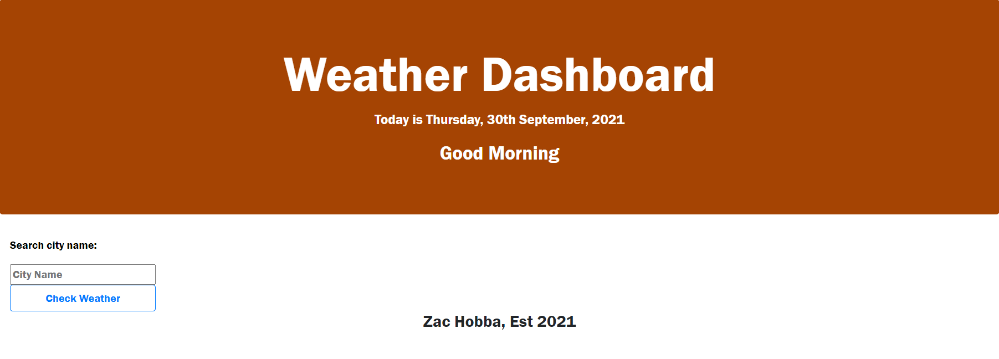
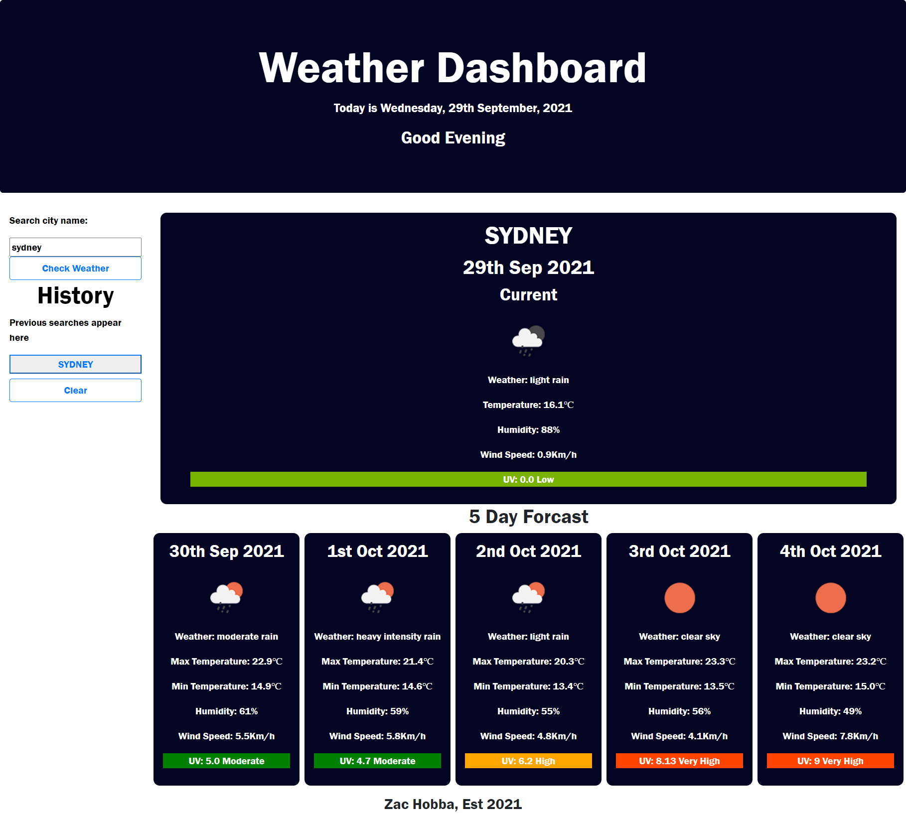

# Weather-API-app
I was tasked with building a weather app that displays the current searched weather and future forcast with the ability to click on previous searches to search for that city again.

### How To Use
Type in the name of the city you want to visit, it will then be saved and appear in the search history section. The openweather Api will be called and display the weather results for your selected city. Click a search history entry to re update the app to that search entry.

### Tecnology Used
HTML, Bootstrap, css, js, Moment.JS, OpenWeather API 

### Screenshot

### Website link
https://hobbaz.github.io/Weather-API-app/